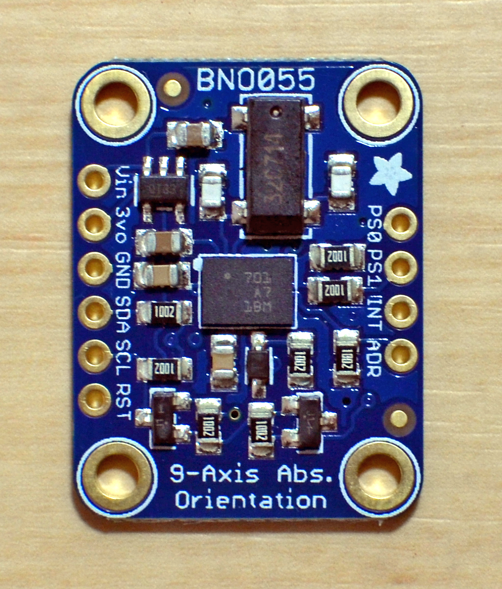

# Pi-BNO055

This is a small demo code for reading data from a Bosch BNO055 IMU sensor via I2C. I wrote it to check if the sensor is working, reading the first seven ID register data. I used a GY-BNO055, and had to fill two solder pads for enabling I2C mode. Later I switched to Adafruit for the superior quality and 5V-level support.



Connecting the GY-BNO055 sensor to the Raspberry Pi I2C bus, the sensor responds with the slave address 0x29. The Adafruit sensor, by default, responds under 0x28.

```
root@pi-ws01:/home/pi# i2cdetect -y 1
     0  1  2  3  4  5  6  7  8  9  a  b  c  d  e  f
00:          -- -- -- -- -- -- -- -- -- -- -- -- --
10: -- -- -- -- -- -- -- -- -- -- -- -- -- -- -- --
20: -- -- -- -- -- -- -- -- -- 29 -- -- -- -- -- --
30: -- -- -- -- -- -- -- -- -- -- -- -- -- -- -- --
40: -- -- -- -- -- -- -- -- -- -- -- -- -- -- -- --
50: -- -- -- -- -- -- -- -- -- -- -- -- -- -- -- --
60: -- -- -- -- -- -- -- -- -- -- -- -- -- -- -- --
70: -- -- -- -- -- -- -- --
```

Compiling the test program:
````
root@pi-ws01:/home/pi/bno055# make
cc -O3 -Wall -g   -c -o i2c_bno055.o i2c_bno055.c
cc -O3 -Wall -g   -c -o getbno055.o getbn
````

Running the test program:
```
pi@pi-ws01:~/pi-bno055 $ ./getbno055 -a 0x28 -t inf -v
Debug: ts=[1534157328] date=Sun Aug 12 19:48:48 2018
Debug: Sensor Address: [0x28]
Debug: Sensor CHIP ID: [0xA0]
Debug: Sensor  ACC ID: [0xFB]
Debug: Sensor  MAG ID: [0x32]
Debug: Sensor  GYR ID: [0x0F]
Debug: SW  Rev-ID LSB: [0x11]
Debug: SW  Rev-ID MSB: [0x03]
Debug: Bootloader Ver: [0x15]
Debug: Operation Mode: [0x10]
1534157328 CHIPID=a0 ACCID=fb GYRID=f MAGID=32 OPMODE=0
OPMODE: CONFIG
```
